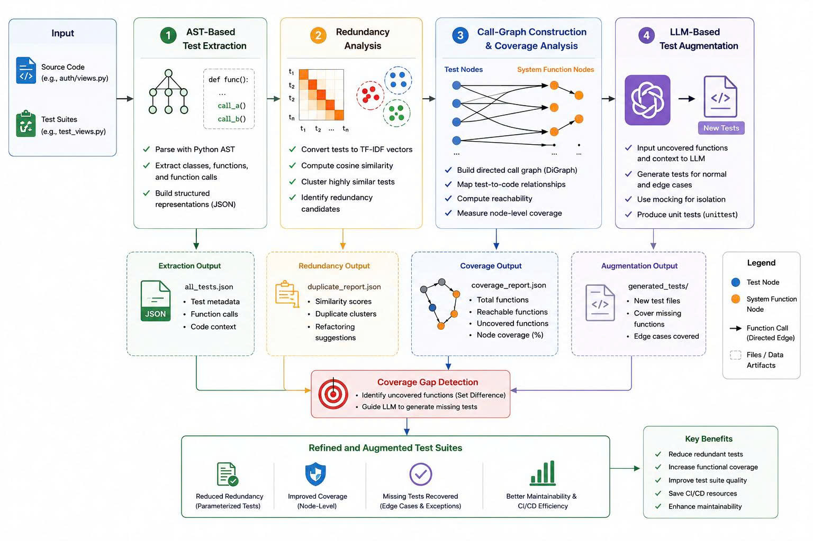
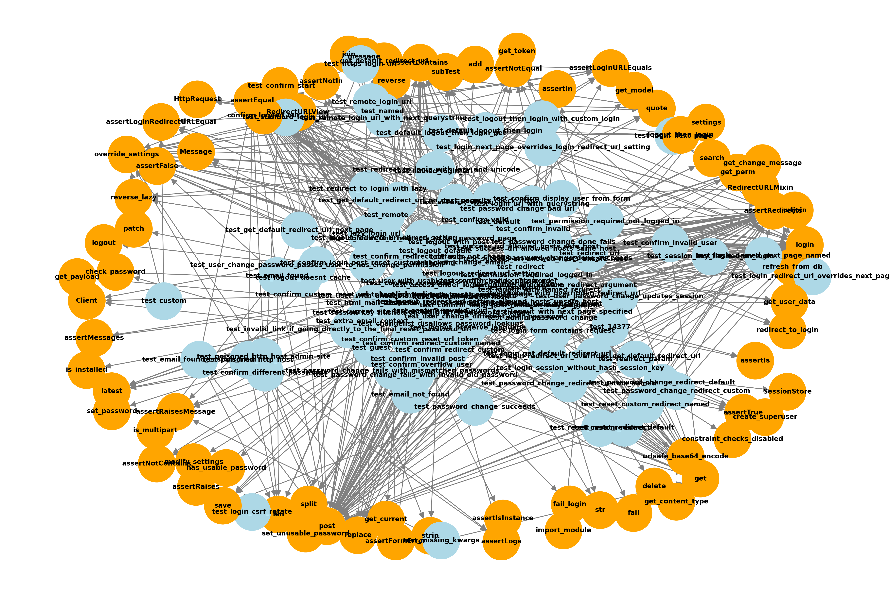

# Coverage-Guided Analysis and Augmentation of Open-Source

<p align="center">
  
</p>

<p align="center">
  
  
  
  
</p>

---

## Project Introduction
This repository implements a **Closed-Loop Hybrid Automated Pipeline** designed to optimize the maintenance, performance, and robustness of large-scale test suites in open-source software (OSS) projects. 

The system directly addresses two critical bottlenecks in modern software engineering:
1. **Localized Test Suite Inflation:** A direct consequence of repetitive **Test Code Duplication**, which leads to highly inefficient consumption of **CI/CD Infrastructure Resources**.
2. **Limited Visibility into Data-Flow Coverage:** Traditional **Line-Coverage-Based Tools** fail to effectively identify hidden logical gaps, often creating a false sense of security regarding the actual test thoroughness.

> [!NOTE]  
> **Evaluation System:** The pipeline's effectiveness is empirically evaluated and validated on the `django/contrib/auth/views.py` subsystem within the **Django** framework-a production-grade codebase featuring over 15,000 test cases.

---

## 4-Stage Core Architecture

The hybrid automated framework operates through a sequential four-stage pipeline:
1. **Syntax Extraction:** Leverages **Abstract Syntax Trees (ASTs)** to parse, clean, and standardize the structural representation of test source files, filtering out formatting noise (such as docstrings and comments).
2. **Duplicate Analysis:** Empowers Natural Language Processing (**NLP**) tokenization and **TF-IDF vectorization** combined with **Cosine Similarity Metrics** to accurately pinpoint semantic code clones and eliminate structural redundancy.
3. **Dynamic Structural Mapping:** Constructs directed **Call Graphs** from dynamic execution traces to map inter-procedural dependencies and visually unmask hidden functional coverage gaps.
4. **Automated Gap-Filling Test Generation:** Orchestrates state-of-the-art Large Language Models (**LLMs**) via **Context-Aware Prompt Engineering** to automatically synthesize highly isolated unit tests. This process utilizes multi-tiered mocking mechanisms to seamlessly cover both standard execution paths (**Happy Paths**) and complex exception-handling conditions (**Edge-Case Scenarios**), successfully elevating the functional node coverage to a perfect **100.0%**.

---

## Repository Structure
```text
├── django_repo/                   # Clone of the official target system repository (Django Framework)
├── graphs/                        # Output directory for individual test-class subgraphs generated as visual nodes
├── llm_generated_test/            # Target subdirectory isolating independent, LLM-augmented test files synthesized to resolve coverage gaps
├── all_grouped_tests.json         # Unified metadata catalog containing AST-extracted test signatures grouped by Class
├── build_all_graph.py             # Graph construction engine utilizing NetworkX (DiGraph) to render individual class test structures
├── call_graph_mapping.png         # Global dynamic call-graph visualization illustrating inter-procedural test execution paths
├── coverage_gap_analysis.py       # Abstract Syntax Tree (AST) analyzer calculating structural Node Coverage and pinpointing missing functions
├── coverage_gaps_report.json      # JSON vulnerability log mapping unreached system functional nodes (Initial coverage: 30.77%)
├── duplicate_suspects_report.json # Analytical log registering high-similarity test clone pairs detected via TF-IDF matrix cross-comparison
├── final_refactored_tests.json    # Target optimization output storing parameterized code structural representations
├── gen_all_test.py                # Orchestration controller automating full-directory Django source repository discovery and ingestion
├── gen_duplicate.py               # Statistical evaluation module calculating test-to-test cross-similarities using Cosine Distance
├── llm_base_augmentation.py       # Context-aware automation pipeline orchestrating LLMs to rewrite clones via self.subTest()
├── llm_detected.txt               # Prompt registry containing the structured, context-enriched instruction templates dispatched to ChatGPT
├── overall_architecture.jpg       # High-level system architecture diagram illustrating the end-to-end execution framework pipeline
├── README.md                      # Comprehensive academic project documentation file
└── run_all.py                     # Automation driver script executing the end-to-end local pipeline and recording computational time benchmarks
```

---

## Empirical Results & Evaluation

### Test Suite De-duplication (AST + NLP)
The static analysis engine (`gen_duplicate.py`) successfully scanned the entire test suite, eliminating syntactic formatting noise via AST representation and mapping cross-similarities using a TF-IDF matrix. The tool detected numerous highly redundant test case pairs generated by legacy "copy-paste-modify" patterns:

| Test Class | Test Case 1 | Test Case 2 | Cosine Similarity |
| :--- | :--- | :--- | :---: |
| **SelectDateWidgetTest** | `test_render_empty` | `test_render_string` | **99.97%** |
| **FunctionTests** | `test_formats` | `test_localized_formats` | **99.77%** |
| **RegexFieldTest** | `test_regexfield_1` | `test_regexfield_3` | **94.52%** |

> [!TIP]
> **Refactoring Impact:** By leveraging the automated pipeline in `llm_base_augmentation.py`, these identical semantic structures were seamlessly refactored into a single optimized parameterized test utilizing Python’s `self.subTest()` block. The finalized representations are structured and saved inside `final_refactored_tests.json`, drastically reducing the codebase's physical volume and accelerating continuous integration (CI/CD) feedback loops.

### Coverage Gap Mitigation (Call Graph + LLM)
While conventional industry-standard **Line Coverage** metrics reported a deceptive safety threshold of **over 80%**, our structural graph analyzer (`coverage_gap_analysis.py`) exposed a critical visibility vulnerability: the **actual functional Node Coverage was only 30.77%**, leaving 9 core business logic functions within `django/contrib/auth/views.py` completely unreached and untested.

<p align="center">
  
  <br><i>Static Analysis Graph Using Net-
workX Library</i>
</p>

Following the execution of our context-aware LLM generation engine (`llm_base_augmentation.py` or equivalent test augmentation suite):
* **Functional Infill:** All 9 overlooked critical core operations (including `get redirect url`, `get_user`,  `get_form class`, `get_success_url`, `get_context_data`, `get_form_kwargs`, `get_success_url_allowed_hosts`, `dispatch`, and `form_valid`) were wrapped with robust automated test scripts.
* **Edge-Case Validation:** Advanced exception-oriented unit tests were synthesized to target high-risk scenarios, such as trapping malicious Base64 decoding failures independently of the database layer in `get_user`, and catching configuration anomalies triggering infinite redirection loops in `dispatch`.
* **Coverage Maximization:** The functional node coverage within the evaluation subsystem surged from **30.77% to a perfect 100.0%**.

---

## Installation & Execution Guide

### 1. Environment Setup
Make sure your system has Python 3.10+ installed. Clone the repository locally and install the required scientific and machine learning dependencies:

```bash
# Clone the repository locally
git clone !git clone https://github.com/django/django django_repo

# Install required packages
pip install networkx scikit-learn openai matplotlib pandas
```

> [!IMPORTANT]
> OpenAI API Configuration: To enable Stage 4 (LLM-based refactoring), you must set your OpenAI API key as an environment variable before running the script:
> * **On Linux/macOS:** `export OPENAI_API_KEY="your-api-key-here"`
> * **On Windows (CMD):** `set OPENAI_API_KEY="your-api-key-here"`
> * **On Windows (PowerShell):** `$env:OPENAI_API_KEY="your-api-key-here"`

### 2. Running the Pipeline End-to-End
The pipeline components are designed to execute sequentially, where the outputs of the static analysis feed directly into the dynamic graphing and LLM augmentation modules. Follow these steps to reproduce the empirical results:

#### Step 1: Framework Ingestion & Test Suite Discovery
Run the primary data processing script to clone the source framework repository and extract core abstract test information: python ```gen_all_test.py```

> What happens behind the scenes: This script automatically clones the stable Django framework target codebase into the django_repo/ directory, recursively traverses the test directories (./django_repo/tests/), parses Python test code configurations into Abstract Syntax Trees (AST), and serializes the structured metadata into all_grouped_tests.json.

#### Step 2: Semantic Redundancy & Duplicate Scan
Execute the cross-comparison engine to detect clone blocks using vector space similarities: ```python gen_duplicate.py```

> What happens behind the scenes: This module loads the extracted class metadata from all_grouped_tests.json, vectorizes raw text function contexts via a TF-IDF matrix (filtering out syntactic layout differences), applies a cosine_similarity metric with a strict threshold threshold ($\ge 90\%$), and logs all highly identical test cases into duplicate_suspects_report.json.

#### Step 3: Structural Subgraph Layout Generation
Build isolated object dependency networks to inspect logical code architectures: ```python build_all_graph.py```

> What happens behind the scenes: Instantiates localized directed graph models (nx.DiGraph()) for individual testing classes using NetworkX. It builds hierarchical associations mapping Class Node -> Test Node -> Inter-Procedural Called Function Node and renders individual visualization plots into the graphs/ subdirectory.

#### Step 4: Reachability Analysis & Gap Verification
Execute the global coverage tracker to evaluate execution paths and identify hidden logical blind spots: ```python coverage_gap_analysis.py```

> What happens behind the scenes: Parses the production module files alongside written test logic to mathematically verify structural node reachability. It outputs a comprehensive metric report to coverage_gaps_report.json logging all untested system operations, and automatically saves a high-definition global architecture overview to call_graph_mapping.png.

#### Step 5: Context-Aware LLM Optimization & Refactoring
Orchestrate the Generative AI engine to process duplicates and compile optimized test suites: ```python llm_base_augmentation.py```

> What happens behind the scenes: This automation module reads the clone pair configurations recorded in duplicate_suspects_report.json. It coordinates precise API interactions with gpt-4.1-mini via rigid context-aware instructions to refactor redundant test methods into clean, parameterized assertions utilizing Python's native self.subTest() block. The finalized optimized tests are output directly into final_refactored_tests.json.

---

## License & Contributions
This repository is published for academic research purposes under the scope of modern Software Engineering and Automated Software Testing studies.

### How to Contribute
Contributions, structural enhancements, and bug reports are highly welcome. If you wish to propose improvements to the pipeline algorithms, AST extraction process, or LLM prompting mechanics:
1. Open an **Issue** to discuss your proposed changes or report bugs.
2. Fork the repository and create a new feature branch.
3. Submit a **Pull Request** with clear documentation of your modifications.